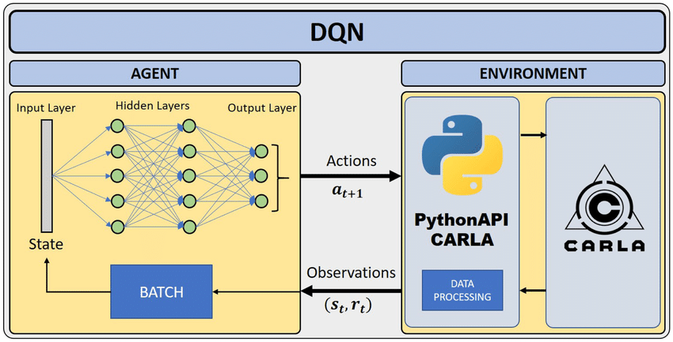

# Senior Project 1 - Stock Price Prediction
## Capstone project made with Python 
<div id="header" align="center">
  
</div>



## Table of contents
* [Collecting data](#collecting-data)
* [Preprocessing data](#preprocessing-data)
* [Training LSTM Model](#training-lstm-model)
* [Prediction from real data](#prediction-from-real-data)
* [Trend direction prediction](#trend-direction-prediction)
* [Deep Reinforcement Learning](#deep-reinforcement-learning)
* [Results](#results)

## Set up
To run this project, install it locally using git
```
git clone https://github.com/Syun1208/stock-price-prediction
```

# Collecting data
You can download data from yahoo.com: `DOGE-USD.csv`, `DOGE_TEST.csv`.

It includes 1532 rows x 6 columns.

# Preprocessing data
```
sc = MinMaxScaler(feature_range = (0, 1))
```
# Training LSTM Model
# Prediction from real data
# Trend direction prediction
# Deep Reinforcement Learning
# Results
Totally, our experiments are reported in the link below.

Link: [Results](https://drive.google.com/drive/u/0/folders/1DeJXSrPA_noV972V5Gg8l5yHGlUw0TkJ)
